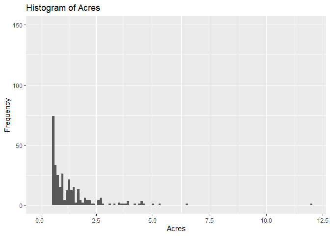
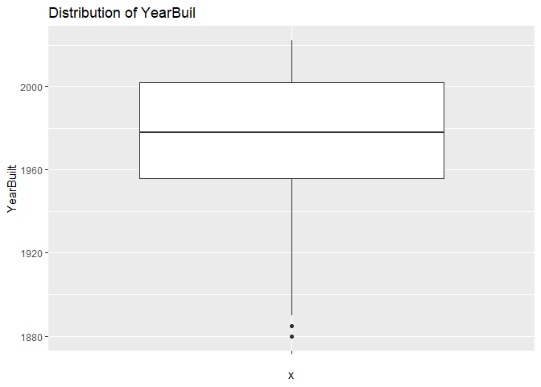
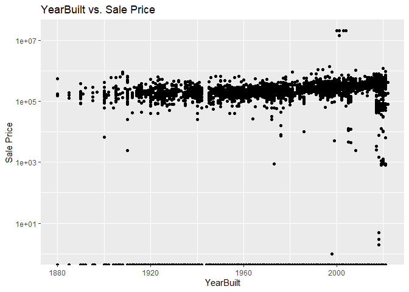

<!-- README.md is generated from README.Rmd. Please edit the README.Rmd file -->

# Lab report \#1

Follow the instructions posted at
<https://ds202-at-isu.github.io/labs.html> for the lab assignment. The
work is meant to be finished during the lab time, but you have time
until Monday evening to polish things.

Include your answers in this document (Rmd file). Make sure that it
knits properly (into the md file). Upload both the Rmd and the md file
to your repository.

All submissions to the github repo will be automatically uploaded for
grading once the due date is passed. Submit a link to your repository on
Canvas (only one submission per team) to signal to the instructors that
you are done with your submission.

1.  Inspect the first few lines of the dataset:

- what variables are there?
  - ParcelID, Address, Style, Occupancy, Sale Date, Sale Price, Multi
    Sale, Year Built, Acres, Total Living Area (ft^2), Bedrooms,
    Finished Basement (ft^2), Lot Area (ft^2), AC, Fire place,
    Neighborhood
- of what type are the variables?
  - chr, chr, factor with 12 levels, factor with 5 levels, date, num,
    chr, num, num, num, num, num, num, chr, chr, factor with 42 levels
- what does each variable mean?
  - The majority of these variables are fairly self explantory such as
    parcel ID, address, sale date, sale price, Year built, acres, total
    living area, bedrooms, finished basement, lot area, AC, and
    fireplace.
  - The variables that are unique include Style which details the type
    of housing with 12 different types listed. Occupancy which details
    the type of housing that this is. Multi sale which determines
    whether the house was sold as a package deal. And finally
    Neighborhood which indiciates which neighborhood this house is a
    part of.
- what do we expect their data range to be?
  - The data ranges for the variables are as follows:

  - Style: 1-12 which correlate with style factor

  - Occupancy: 1-5 which correlate with occupancy factor

  - Sale Date: Date between Jan 1 2017 and Decemeber 31 2022

  - Sale Price: Number between 0 and 20500000

  - Year Built: num between 0 and 2022

  - Acres: Number between 0 and 13

  - Total Living Area: Number between 0 and 6007

  - Bedrooms: Number between 0 and 10

  - Finished Basement Area: Number between 10 and 6496

  - Lot Area: Number between 0 and 523228

  - Neighborhood: 1-42 which correlates with Neighborhood factor

2.  is there a variable of special interest or focus?
    - The obvious variable of special interest is Sale Price; we chose
      this because all other variables have the potential to affect the
      Sale Price variable and it would likely have the highest range.
3.  start the exploration with the main variable:

- what is the range of the variable?
  - The range is between 0-20,500,000
- draw a histogram for a numeric vaiable or a bar chart, if the variable
  is categorical.

``` r
library(ggplot2)
library(classdata)
ggplot(ames, aes(x=ames$"Sale Price")) + geom_histogram(binwidth = 6000) + xlim(0, 1100000) + ylim(0, 150)
```

    ## Warning: Use of `ames$"Sale Price"` is discouraged.
    ## ℹ Use `Sale Price` instead.

    ## Warning: Removed 368 rows containing non-finite values (`stat_bin()`).

    ## Warning: Removed 2 rows containing missing values (`geom_bar()`).

<!-- -->

- what is the general pattern? is there anything odd?
  - The distribution of Sale Price follows a right-skewed distribution
    around a median of 170900.
  - There are several large spikes, including at 0, which are points in
    the data set where units of a building involved in a multisale were
    all marked as being sold for the total price of the apartment
    building. There were also many records with a recorded sale price of
    \$0.

4.  pick a variable that might be related to the main variable.

- what is the range of that variable? plot. describe the pattern.

- what is the relationship to the main variable? plot a scatterplot,
  boxplot or facetted barcharts (dependening on the types of variables
  involved). Describe overall pattern, does this variable describe any
  oddities discovered in 3? Identify/follow-up on any oddities.

Carter Parks: **Acres**- This variable has range 0 - 12.012

``` r
ggplot(ames, aes(x = Acres)) +
  geom_histogram(binwidth = 0.1) +
  xlim(0, max(ames$Acres)) +
  ylim(0, 150) +
  labs(title = "Histogram of Acres",
       x = "Acres",
       y = "Frequency")
```

    ## Warning: Removed 89 rows containing non-finite values (`stat_bin()`).

    ## Warning: Removed 6 rows containing missing values (`geom_bar()`).

<!-- -->

The acres variable follows an interesting pattern; most entries have
values between 0 and 1, with the most entries in the first bin (0 -
0.1). Entries with higher values are few and far between; but there is
one entry at 12 acres.

``` r
ggplot(ames, aes(x = Acres, y = `Sale Price`)) +
  geom_point(color = "blue") +
  labs(title = "Scatterplot of Acres vs Sale Price",
       x = "Acres",
       y = "Sale Price")
```

    ## Warning: Removed 89 rows containing missing values (`geom_point()`).

<!-- -->

The acres variable has an odd relationship with Sale Price. It seems the
vast majority of entries fall into the category with sub-2.5 acres and
sales price less than 2,000,000. This makes it easy to identify the
outliers, but more difficult to recognize a relationship between acres
and sales price.

Ryan Rockey: **YearBuilt**

- This variable has the range 1880 - 2022. There is one record with a
  incorrect YearBuilt value of 0 which I am ignoring for my purposes.

``` r
ames_revised <- ames[ames$`YearBuilt` != 0, ] # removing the value where YearBuilt is 0

ggplot(ames_revised, aes(x="", y=YearBuilt)) + geom_boxplot() + ggtitle("Distribution of YearBuil")
```

    ## Warning: Removed 447 rows containing non-finite values (`stat_boxplot()`).

<!-- -->

- The distribution of YearBuilt is heavily skewed left, which makes
  sense considering population growth will lead to more construction
  being required as time progresses.

``` r
ggplot(ames_revised, aes(x=YearBuilt, y=`Sale Price`)) + geom_point() + scale_y_log10() + ggtitle("YearBuilt vs. Sale Price")
```

    ## Warning: Transformation introduced infinite values in continuous y-axis

    ## Warning: Removed 447 rows containing missing values (`geom_point()`).

<!-- -->

- The pattern of the scatter plot follows a slightly positive, linear
  correlation. Many outliers are present across all years.  
- One oddity the clear line of points across the chart where Sale Price
  = 0.  
- Also, because the dataset compiles properties sold from 2017 to 2022,
  there is a clear increase in properties after 2017 due to all the new
  constructions that are also accounted for.
